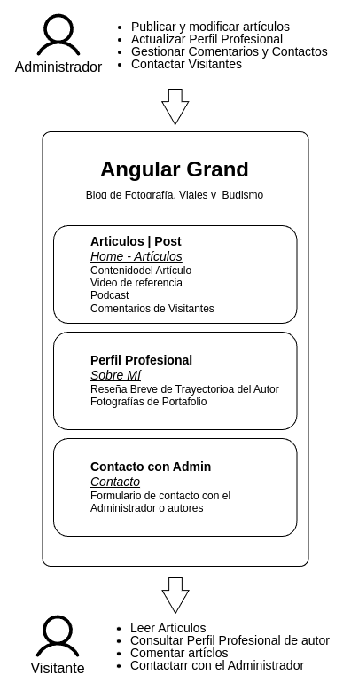

# Documentación 

La aplicación es un Blog básico deonde el Autor(propietario) puede cargar artículos(post), 
gestionarlos(crud) y recibir visitas. También puede mostrar un perfil prefesional y fptpgrafías
de su portafolio.

<br>
<div style="text-align:center">

</div>
<br>

## Instalación
Al ser un proyecto en el framework Python Django, se recomienda trabajar dentro de un entorno virtual
```
pyrhon -m virtualenv <entorno>
```

