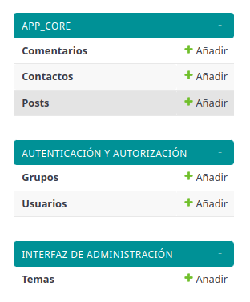
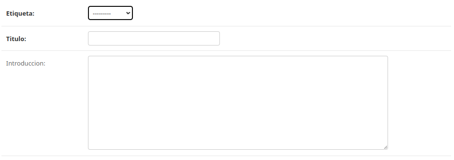
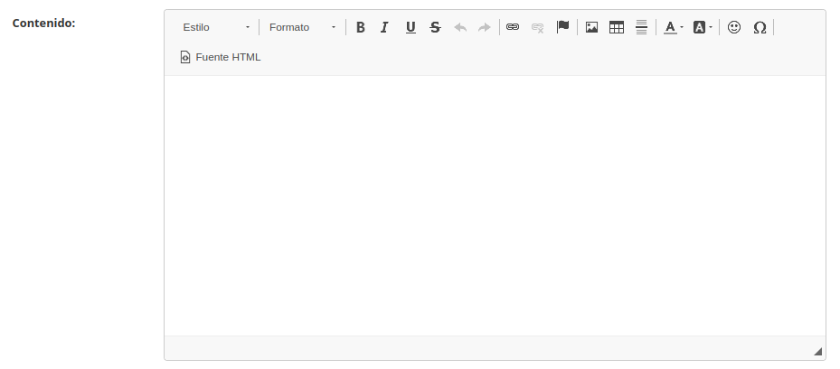
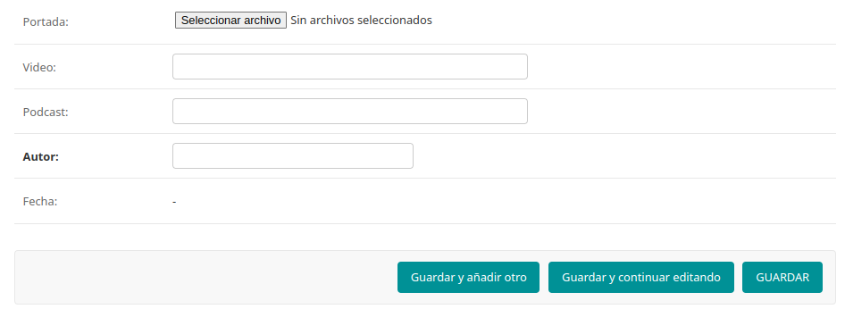

# Crear nuevos Post o Artículos
[volver a home](../README.md)
A continuación se detallan los procesos que debe aplicar el Administrador
para crear nuevos artículos en el blog.

Todas los registros son modificables por el Administrador, estos podrán ser:
* Creados, agregar nuevos registros.
* Leídos, revisión del contenido de los registros.
* Modificados, cambiar contenido de los registros.
* Eliminados, borrar registros

## Publicación de nuevo Post (Artículo)
Para la publicaciṕn de un nuevo artículo, el Administrador(propietario) debe ingresar con sus
credenciales de administrador a la dirección `http://angulargrand/admin/`, la cual lo dirigirá
al Panel de Adminitración.
En el meú de la izquierda se encontrarán las opciones:

* Comentarios  -> listado general de Comentarios de los visitantes en los artículos
* Contactos    -> Listado de visitantes y mensajes enviados al Administrador
* Post         -> Lista General de Artículos publicados por el Administrador
La sección para agregar nuevos Post(artículo) cuenta con el editor de texto enriquecido (ckeditor) que permite visualizar el texto
tal cual será publicado, permitiendo dar estilos al texto, ingresar iconos, emoticonos, tablas,
líneas, etc.

**<imagen de formulario Post del panel>**

* Etiqueta: temas opcionales (fotografía - budismo).
* Título: nombre del artículo.
* Introducción: breve antesala al artículo (máx 200 carácteres).

* Contenido: extensión del artículo -> ckeditor.

* Portada: imagen de presentación del post -> carga de archivo .webp.
* Video: link de video referente al artículo o material complementario.(campo opcional)
* Podcast: audio referente o material complementario del artículo. (campo opcional)
* Autor: nombre del creador del artículo.
* Fecha: fecha de creación -> se genera automáticamente.

Para guardar los cambios y publicar el artículo, presionamos **Guardar**.

### Carga de Videos en artículos desde Youtube
Los videos pueden ser directamente incrustados desde youtube usando el siguiente procedimiento:
* 1- Ubicar el video deseado en youtube.com y debajo en las opciones del video presionar *Compartir* 
* 2- En el submenú de *Compartir*, seleccionaremos el ícono **<>** que nos dará el código html para 
embeber el frame con el video.
* 3 - De dicho código tomaremos sólo el siguiente fragmento *https://www.youtube.com/embed/xxxxxxxxxx?si=xxxxxxxxxxx*
Para todos los videos el código aquí identificado con xxxxxxxxxxx es distinto.
* 4- Este fragmente es el que debemos ingresar en el campo video del panel de Administración del Blog
para agregar un video al artículo.
* 5- Despues de ingresado todo el contenido del Post(articulo), presionamos *Guardar* abajo a la derecha.
* 6- Podremos verificar que los cambios se han realizado y el Post se carga correctamente, visitando el 
sitio y la dirección correspondiente al artículo. Si se necesitan hacer modificaciones, podremos dirigirnos
nuevamente al Panel de Administración -> Sección Post -> seleccionar de la lista el post que se quiere modificar.

### Carga de audios para podcast desde Google Drivre
En los artículos se pueden cargar audios(podcast) que profundicen más el tema o den una mejor experiencia
y entendimiento al visitante. Para cargar audios almacenados en Drive debemos seguir el siguiente
procedimiento:
* 1- Previamente, al audio debe estar almacenado en una cuenta Google Drive de la cual d¿se tenga acceso
y permiso de editor, una cuenta propia preferiblemente.Este audio debe ser en formato **mp3** y previamente 
editado como desee el Administrador.
* 2- Ubicando el archivo, abrirlo. Drive mostrará una vista previa y reproducirá el audio, acá solicitaremos
abrir el archivo en una nueva pestaña ingresando el el menú de tres puntos **󰇙** arriba a la derecha.
* 3- El audio abrirá en una nueva pestaña y desde aquí es que copiaremos la dirección url que será parecida
a la siguiente: https://drive.google.com/file/d/xxxxxxxxxxxxxxxxxxxxxxxxxxxxx/view, las x representan el id 
único del archivo, este varía de archivo en archivo.
* 4- Cambiaremos la última palabra **view** por **preview** quedando así:
**https://drive.google.com/file/d/xxxxxxxxxxxxxxxxxxxxxxxxxxxxx/preview**.
* 5- Este será el link que se podrá ingresar en el Panel de Administración en la sección de nuevo Post.
* 6- Despues de ingresado todo el contenido del Post(articulo), presionamos *Guardar* abajo a la derecha.
* 7- Podremos verificar que los cambios se han realizado y el Post se carga correctamente, visitando el 
sitio y la dirección correspondiente al artículo. Si se necesitan hacer modificaciones, podremos dirigirnos
nuevamente al Panel de Administración -> Sección Post -> seleccionar de la lista el post que se quiere modificar.

[volver a home](../README.md)
