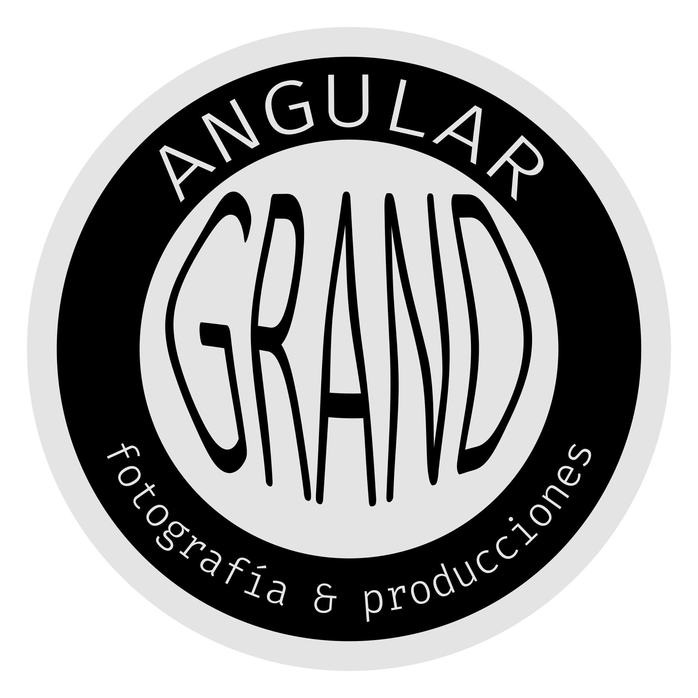

# Blog Angular Grand
Gustavo Colmenares [GUScode] | [código del proyecto](https://github.com/Gustavo9481/Blog_AngularGrand)  

 
Un viaje visual por Venezuela, capturando momentos a través del lente, 
explorando senderos y reflexiones.
AngularGrand es un espacio digital que fusiona la fotografía artística 
con la narrativa de viajes y la introspección del budismo.
 

## Contenido:
* Documentación General
* [Crear nuevos Post o Artículos](./Documentacion/post.md)
* [Índice de Comentarios del código](./Documentacion/comentarios.md)

---
 
    

